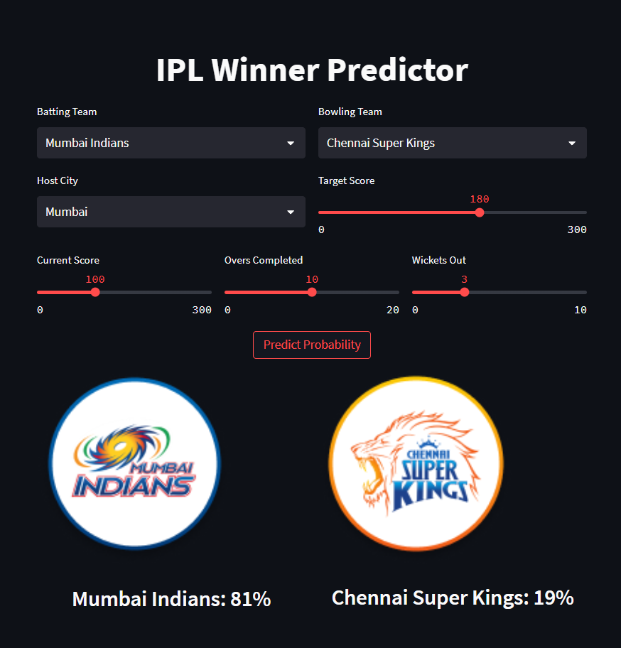
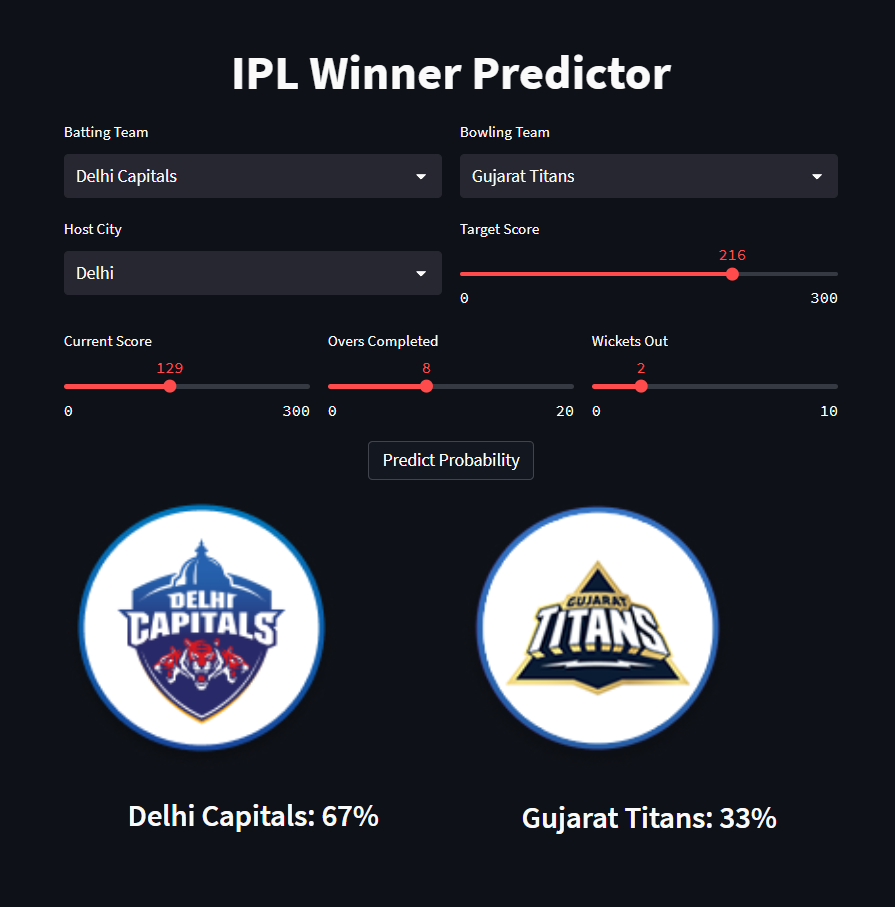

# IPL Match Winner Predictor



This project predicts the probability of a team winning an IPL match using a pre-trained model served through a Streamlit web application.

## Features
- Interactive UI for entering match situation
- Displays win/loss probabilities and team logos
- Docker container for easy deployment

## Directory Structure
```
assets/            # project images and logos
  logos/           # team logos used by the app
data/              # datasets and generated features
models/            # trained models
src/               # application and preprocessing scripts
```

## Local Development
1. Install Python 3.10 or later.
2. Install dependencies:
   ```bash
   pip install -r requirements.txt
   ```
3. Run the application:
   ```bash
   streamlit run src/app.py
   ```

## Docker Usage
To build and run using Docker:
```bash
# build image
docker build -t ipl-predictor .
# start container
docker run -p 8501:8501 ipl-predictor
```
Then open `http://localhost:8501` in your browser.

## Data Preparation
`src/preprocess_data.py` can be used to regenerate the training data and model. The raw CSV files should be placed in the `data/` directory.
Pretrained models are provided under `models/` so you can run the app without rerunning preprocessing.

## Screenshots


